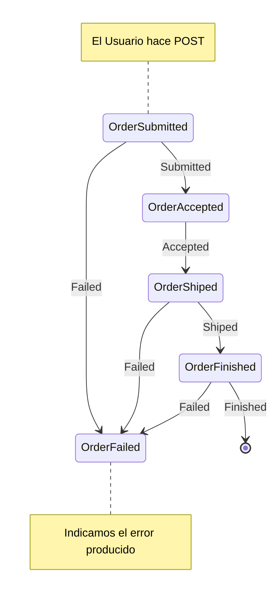

<<<<<<< HEAD
ии
=======

## Stack
- Opentelemetry
- EfCore
- Masstransit
- Netcore 6

## How To Run
- In development, just debug 
>>>>>>> a8730be4f8443b2d13adc70c74c82b31d21fabda

```mermaid
    stateDiagram-v2
        OrderSubmitted --> OrderAccepted : Submitted 
        note left of OrderSubmitted
            El Usuario hace POST
        end note
        OrderSubmitted --> OrderFailed : Failed 
        OrderAccepted --> OrderShiped : Accepted
        OrderShiped --> OrderFailed : Failed
        OrderShiped --> OrderFinished : Shiped
        OrderFinished --> OrderFailed : Failed
        OrderFinished --> [*] : Finished
        note right of OrderFailed
           Indicamos el error producido
        end note
```
