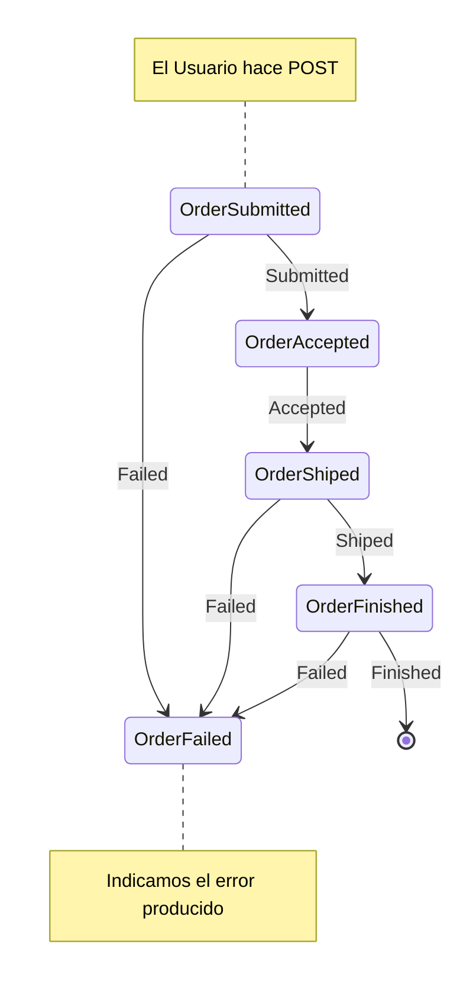

```mermaid
    stateDiagram-v2
        OrderSubmitted --> OrderAccepted : Submitted 
        note left of OrderSubmitted
            El Usuario hace POST
        end note
        OrderSubmitted --> OrderFailed : Failed 
        OrderAccepted --> OrderShiped : Accepted
        OrderShiped --> OrderFailed : Failed
        OrderShiped --> OrderFinished : Shiped
        OrderFinished --> OrderFailed : Failed
        OrderFinished --> [*] : Finished
        note right of OrderFailed
           Indicamos el error producido
        end note
```